# Wazuh Homelab

Deploying the open-source SIEM/EDR solution Wazuh and stress testing the capabilities of the platform.

## Table of Contents
1. [Environment Setup](#environment-setup)
2. [Deploying Wazuh Server VM](#deploying-wazuh-server-vm)
3. [Deploying Kali VM](#deploying-kali-vm)
4. [Deploying Windows VM](#deploying-windows-vm)
5. [Deploying Wazuh Agents](#deploying-wazuh-agents)
    - [Deploying Wazuh Agent to Kali VM](#deploying-wazuh-agent-to-kali-vm)
    - [Deploying Wazuh Agent to Windows VM](#deploying-wazuh-agent-to-windows-vm)
6. [Stress Testing our Agents](#stress-testing-our-agents)
    - [Manual Testing](#manual-testing)
    - [Automated Testing](#automated-testing)

## Environment Setup

### Deploying Wazuh Server VM

To get started we’re going to deploy the Wazuh Server locally on a VirtualBox VM. The documentation is up to date and very robust.

Kicking us off we’re going to install the OVA file from the above linked documentation then deploy it within a VirtualBox VM.

We won't cover how to deploy an OVA file to VirtualBox but you can find a great example here. After we have deployed the VM let's launch it and see if it successfully launches. After starting it up and logging in using default credentials we see the terminal below. This indicates that the deployment of the Wazuh Server is successful!

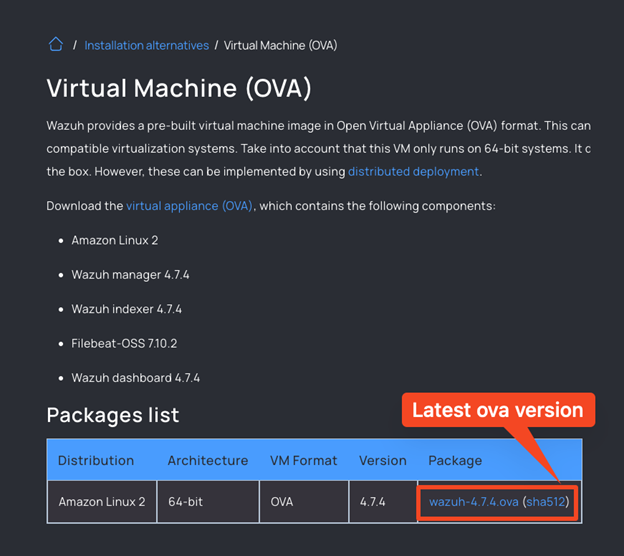

At this point we need to find the IP address of the Wazuh Server so we can access it from our host machine over the LAN. To do this we will run “ip a”. Highlighted below is the IP address of the server!

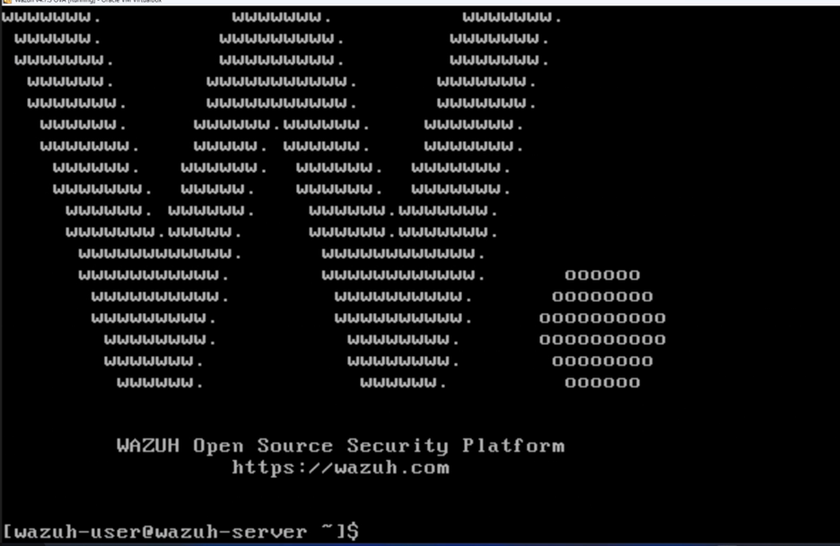

Now that we have the IP we can browse there (https://192.168.0.4). On browsing there we are welcomed by the Wazuh Server login page.

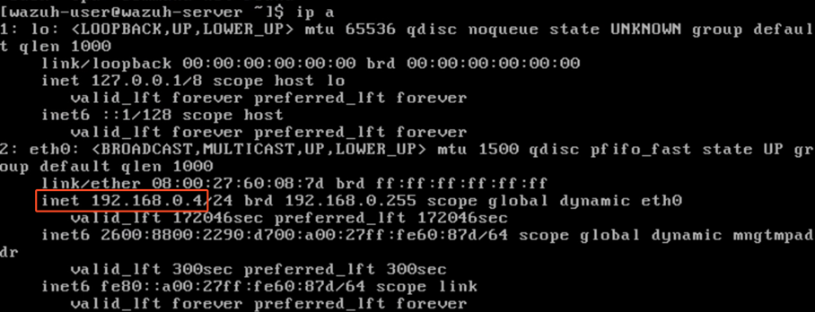

We are given default credentials within their documentation to login here. After logging in we see the Wazuh Server main dashboard.

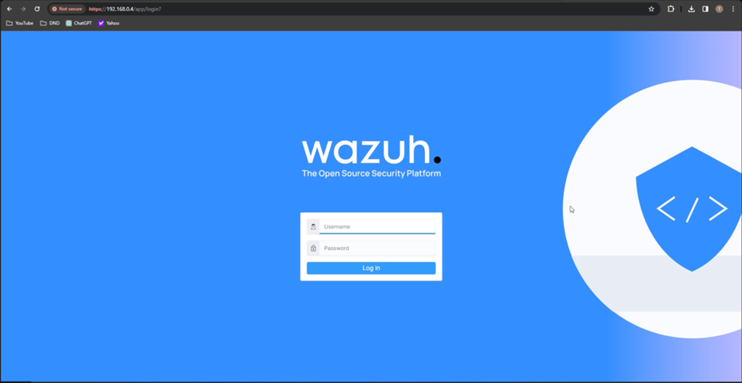

### Deploying Kali VM

We want to test the Wazuh Agents on a range of devices. We’re going to test on a Linux VM (Kali) and a Windows VM.

Getting started with Kali we need to go download the relevant files from Kali.org. The file can be downloaded here. Always remember to verify the hash checksum with what you downloaded.

To verify the checksum of the hash after installing the zip file do the following:
1. Open a terminal.
2. Change to the directory that has the zip file.
3. (On Windows command prompt) Use the command “-hashfile <zip file name> SHA256”

By specifying the hash type in the command we ensure we are checking for the same hash type that Kali provided on their website.

After deploying the VM within VirtualBox firing it up and authenticating we are welcomed by the Kali Desktop.

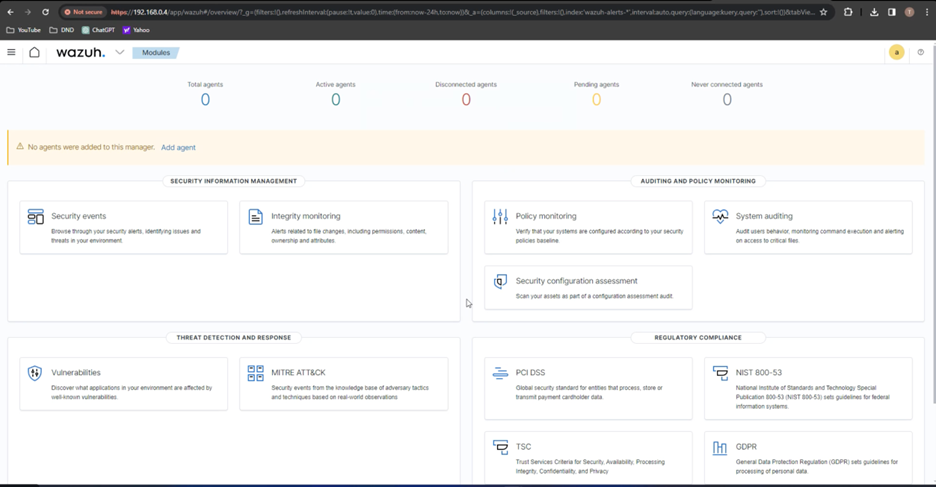

At this point we're not sure if we need internet connectivity for the agent to be fully functional or if being on the same LAN is enough. Let's go ahead and verify internet connectivity by pinging Google (8.8.8.8) and see if we get a response we can see in the screenshot below we do!

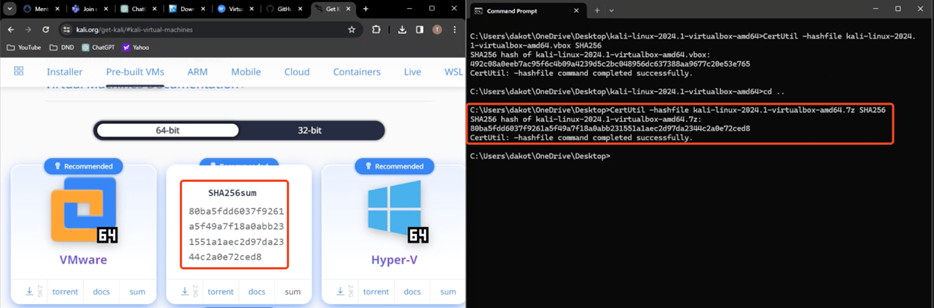

### Deploying Windows VM

Same as with the other VMs we’re going to go download the necessary files for the VirtualBox VM here.

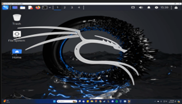

After installing the zip file make sure to check the hash checksum. Last time we used the Windows command prompt this time let's use PowerShell:
1. Launch PowerShell.
2. Instead of changing to the directory that has the zip file let's provide a path.
3. Run “Get-FileHash –Path <path\to\zip\file> -Algorithm SHA256”.

Again we specify the algorithm to match the checksum from Microsoft. They match so we’re good to continue!

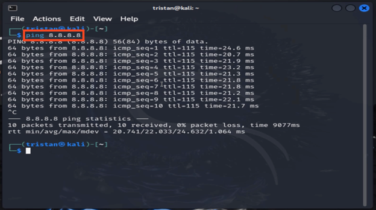

From here we deploy the ISO within the zipped file to VirtualBox. Below you can see we have launched the VM successfully.

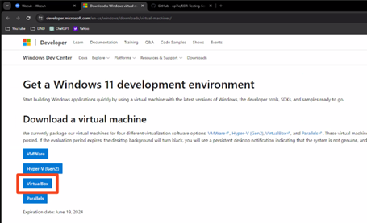

## Deploying Wazuh Agents

### Deploying Wazuh Agent to Kali VM

We have set up our Wazuh Server and our 2 test virtual machines. Now we need to deploy Wazuh Agents on them to collect telemetry on the agents and give us visibility into those hosts. From the login page let’s click “Add Agent”.

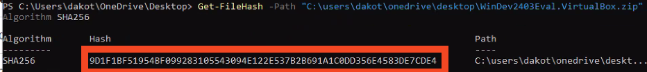

Wazuh walks us through this process thankfully. We’ll need to walk through several steps here:
1. Select OS/Architecture of the host machine to get the Agent deployed.
2. Assign a server address. (This will be where the Agent checks-in we want to use the Wazuh Server IP here.)
3. (Optional) Set a name of this agent I chose ‘KaliAgent’.

After these steps you will be given a command to copy/paste onto the host that it set to get the agent. It will install the agent with “wget” and set environment variables.

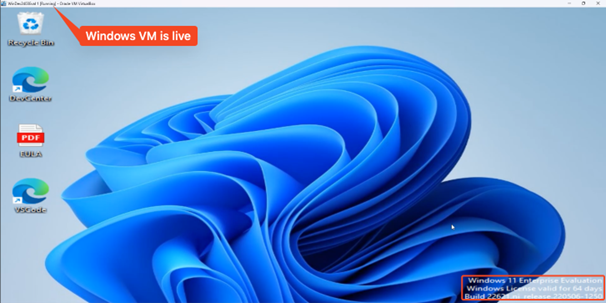

If you're on Linux and wondering how to tell what architecture the VM is running you can run “uname -srp” in your terminal.

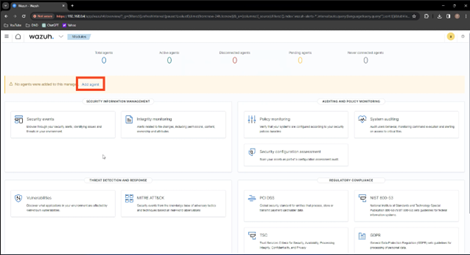

Below is the command we are given to copy/paste onto the target host.

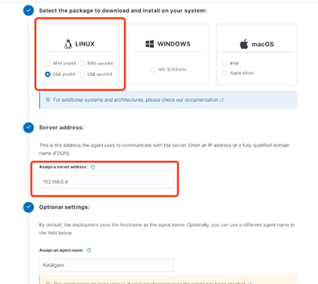

Going over the Kali Linux VM we verify that we are in a bash terminal session by running “bash” and then we paste the command from Wazuh Server and run it.

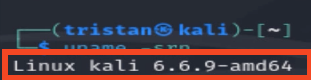

The command seems to have run successfully! Let's login to the Wazuh Server over HTTPS to see if we have an agent checking in to the Wazuh Server.

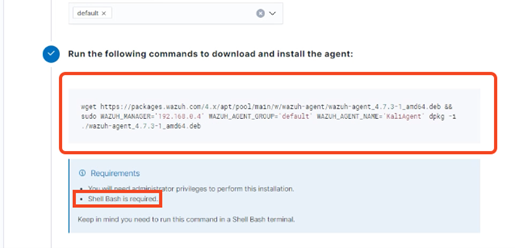

We do! At this point we’ve deployed our first Wazuh Agent and that agent is checking into the Wazuh Server shipping telemetry to the Wazuh Server and listening for commands/configuration profiles.

### Deploying Wazuh Agent to Windows VM

Deploying the Wazuh Agent to the Windows VM follows the same process of going through the agent deployment “wizard” so not including a screenshot of that. The below screenshot is the command that I pasted onto the Windows VM and we can see it ran successfully!

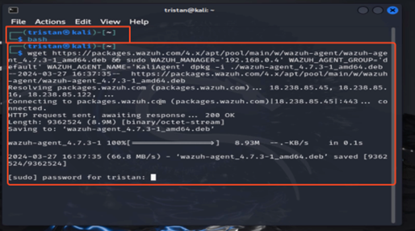

It should be noted on Windows devices after running the command you copy from the Wazuh Server you need to start the service with “NET START WazuhSvc”.

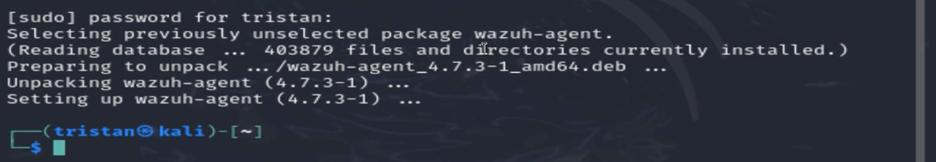

After deployment we again go check in the Wazuh Server to see if the agent is checking in to the Wazuh server and our 2nd agent is calling home!

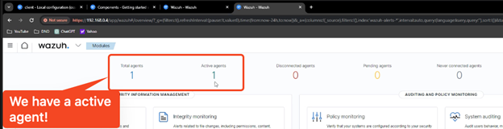

## Stress Testing our Agents

At this point we’ve deployed 2 Wazuh Agents that are sending their logs/checking in to the Wazuh Server. I’m curious if we can trigger a malicious alert in the Wazuh Server web console - let's start with manual testing.

### Manual Testing

To start let's try some low-hanging fruit and see if Wazuh alerts us when a user installs the Metasploit Framework. Since using our browser to install this blocks it as malware well use wget here to pull down the latest .msi file.

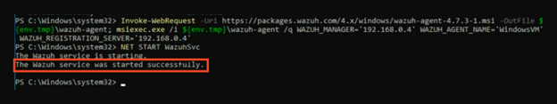

Let's also do some port scanning from Kali VM to the Server and see if Wazuh picks up on this.

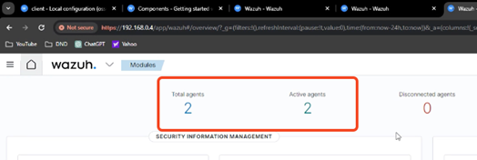

In the screenshot below you can see we launched metasploit after using the “msfconsole” command in our regular terminal session.

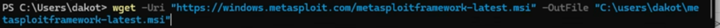

Let's search for a port scanner exploit using “search portscan”.

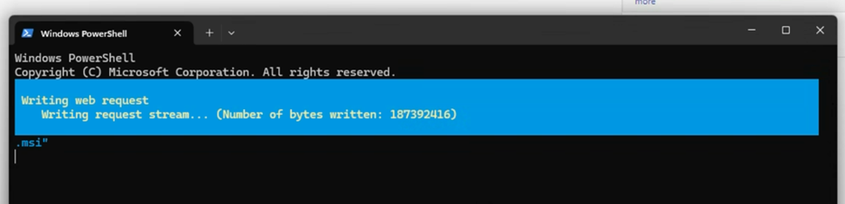

In our case we want to use #5 to launch a TCP port scan so we enter the “use 5” command.

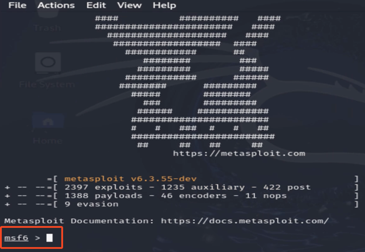

Let's see what options are required for the exploit to run. We can do this by running “options” as see below.

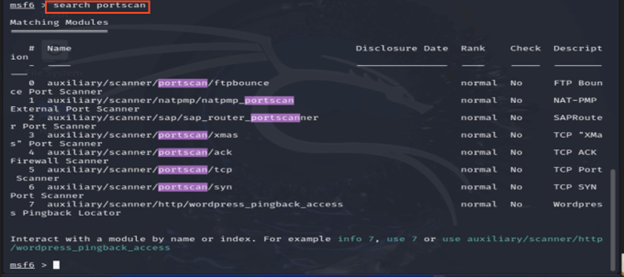

Looks like the only option we still need to set is RHOSTS. RHOSTS stands for Remote Hosts and this value will be the target of our port scan. Let's set RHOSTS as seen below. “set RHOSTS <target server IP>”

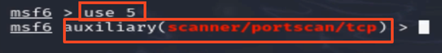

Now let's run this exploit using “exploit” as below:

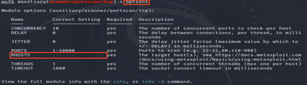

Reviewing the results of the port scanner we see open ports on 22, 111, and 443! Let's go see if Wazuh has alerted us to activity from either installing Metasploit on the Windows VM or running a port scan from the Kali VM.

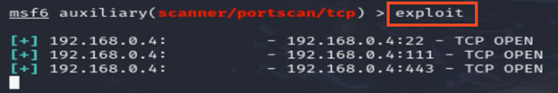

Installing the framework generated no high rule events and neither did our port scanning. However Wazuh is ingesting endpoint logs Windows Event Logs for Windows agents and syslog on Linux agents. Let's go see if we can find our activity!

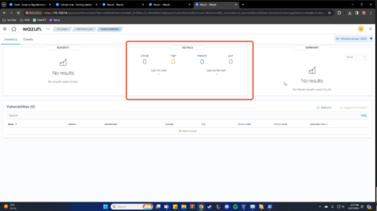

We still see this activity though by searching for it with queries and can tune this going forward to generate alerts for human review on Metasploit installs/usage for example.

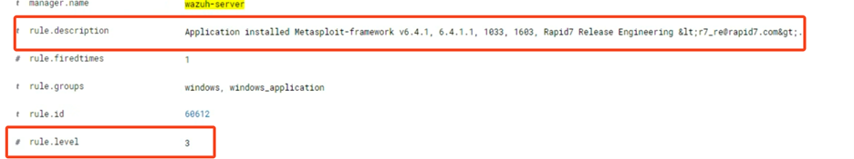

Let's try another hopefully noisier test. On our Windows VM let's create a new user then add that user to the local administrator group. We can do that with the following commands on a Windows host:
1. `net user <name of your user> <password for that user> /add`
2. `net localgroup Administrators <name of your user> /add`

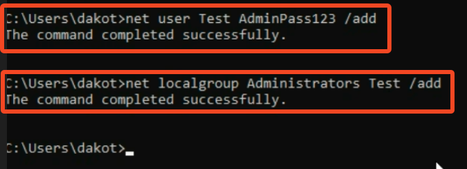

Going back to the Wazuh web interface we see that 2 high severity rules have been generated! Let's go see what we have.

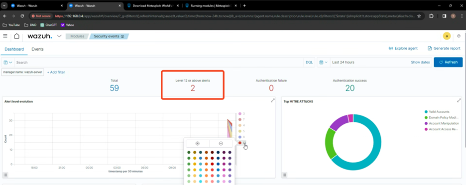

Immediately after clicking on the “2” we see the logs in their SIEM module. We can quickly identify which agent is affected, the MITRE ATT&CK technique, and a brief description of the activity seen.

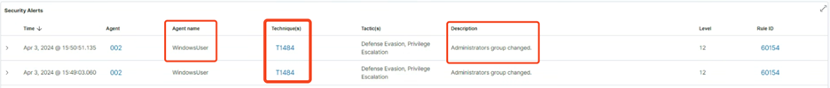

### Automated Testing

Now that we’ve done some manual testing let's try using an Endpoint Detection and Response (EDR) testing script that will perform a few MITRE ATT&CK techniques but the payload is the Windows calculator. The script can be found here - all credit to op7ic for creating it. We’re going to download the code using the green button pictured below.

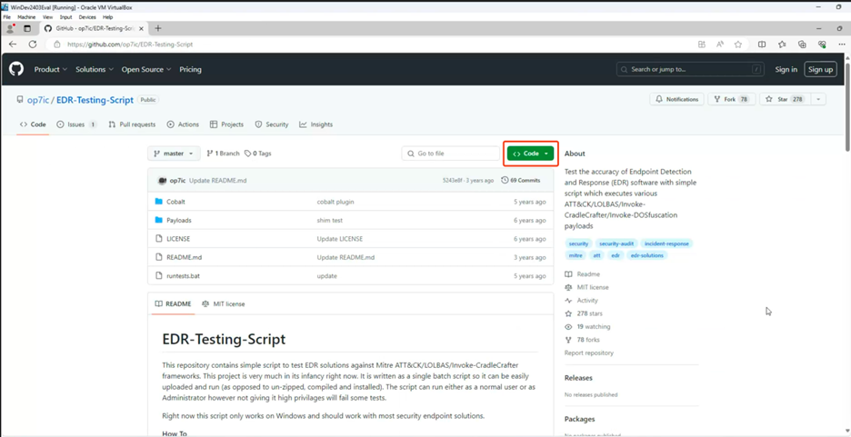

However our browser blocks the download and labels it as malware.

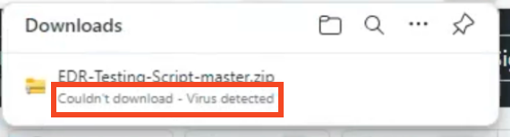

We can get the file another way. Let's fetch it with “wget” at the terminal. We receive a 200-response indicating it was successful.

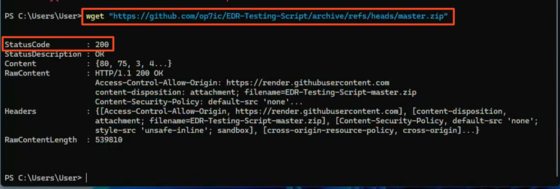

Once the script is installed we unzip the file and run “runtests.bat” with `./runtests.bat`. (Make sure you're in the same directory as the bat file). Below we can see about 15 minutes after it started running Windows Defender is generating alerts and its “payload” of calc.exe keeps dropping on the desktop.

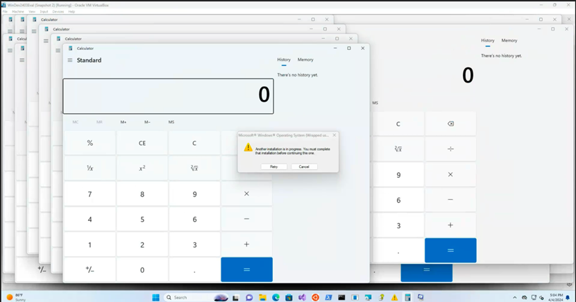

Logging into the Wazuh Server over HTTPS we didn't get any new high severity alerts like we did when creating and adding a new user. However in the Wazuh MITRE ATT&CK dashboard we can see a ton of activity from the script.

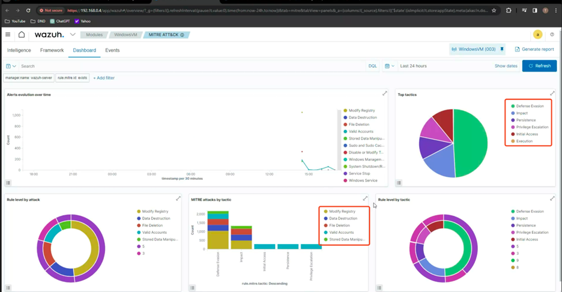

Under the “Top tactics” pie chart in the top right lets click into “Persistence”. This brings us into their SIEM query editor. Additionally you can put on more filters to drill down or filter out noise.

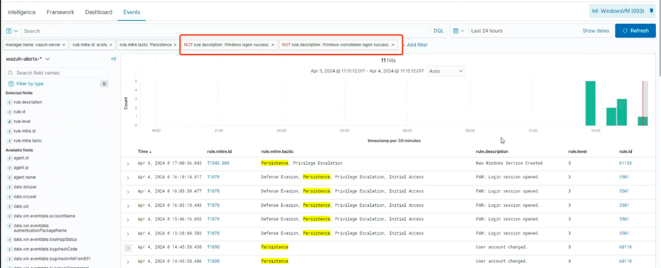

While exploring the results an event log showing a new service being created sparked interest. Let's investigate it further.

While checking the field values for this event the name of the created service was “evilservice” we can also see the parent process was calc.exe the payload of the EDR testing script.

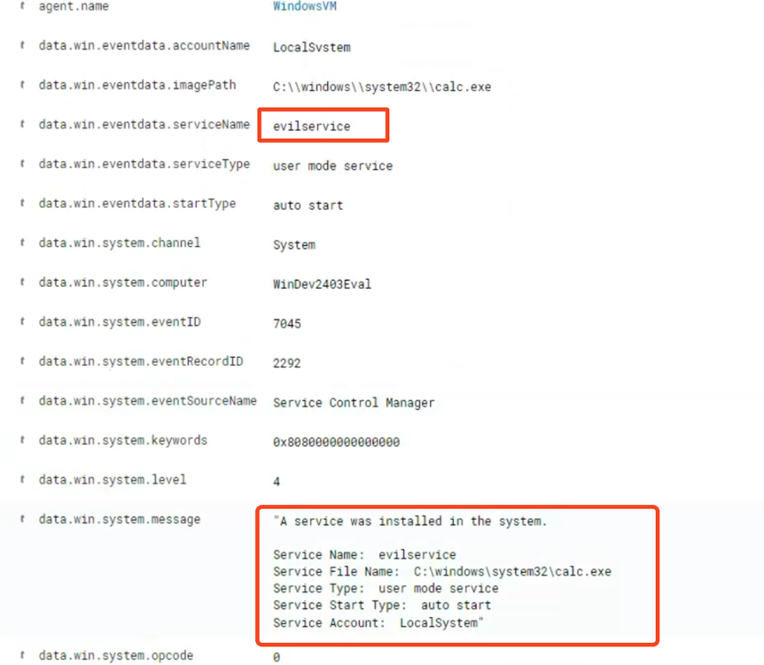

Just to confirm we can review the source code of runtests.bat and we see line 488 and 499 creating and starting the service.

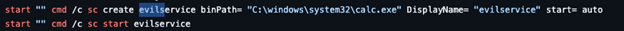

Back on the Windows VM we can check if this service is still running. Based on our PowerShell query it is not.

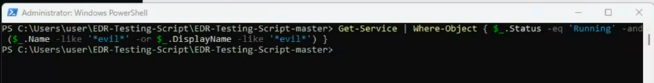
